# Dynatrace AI Observability — VS Code Extension

Observe AI assistant usage (GitHub Copilot Chat, Claude Code) via OpenTelemetry and send traces directly to Dynatrace — with no Docker, no manual collector setup, and no extra infrastructure.

```
VS Code / Cursor
  ├─ GitHub Copilot Chat  ──┐
  └─ Claude Code (hooks)  ──┤─→ OTel Collector (local process, ~50 MB RAM)
                             └─→ HTTPS → Dynatrace SaaS (Grail)
```

**What gets captured:**

| Source | Prompt | Response | Model | Duration | Tokens | Tool calls |
|---|---|---|---|---|---|---|
| GitHub Copilot Chat | ✓ | ✓ | ✓ | ✓ | ✓ | — |
| Claude Code | opt-in¹ | opt-in¹ | ✓ | ✓ | ✓ (incl. cache) | ✓ with input/output |

> ¹ Prompt and response content are **not captured by default** (privacy). Enable via `dynatraceAiObs.capturePrompts: true` in VS Code settings.

> **AI Obs "Prompts stream":** Claude Code spans appear in the Prompts stream tab alongside GitHub Copilot Chat. Model Version, Duration, and Token counts are always populated. **Input/Output fields require `dynatraceAiObs.capturePrompts: true`** (disabled by default for privacy). **Known limitation:** System Prompt shows `-` — Claude Code does not expose its system prompt to hooks.

---

## Table of contents

- [Prerequisites](#prerequisites)
  - [Dynatrace tenant](#dynatrace-tenant)
  - [Developer machine](#developer-machine)
- [Installation (end users)](#installation-end-users)
- [Custom attributes](#custom-attributes)
- [Understanding token counts](#understanding-token-counts)
- [Validating data in Dynatrace](#validating-data-in-dynatrace)
- [DQL Dashboard for Claude Code](#dql-dashboard-for-claude-code)
- [Available commands](#available-commands)
- [Extension settings](#extension-settings)
- [Cursor](#cursor)
- [Troubleshooting](#troubleshooting)
- [Building from source](#building-from-source)
- [Privacy and security](#privacy-and-security)
- [License](#license)

---

## Prerequisites

### Dynatrace tenant

| Requirement | Detail |
|---|---|
| Tenant type | SaaS Latest or Managed with Grail enabled |
| App | AI & LLM Observability (install from Hub) |
| API token | Scopes: `openTelemetryTrace.ingest` + `metrics.ingest` |

<details>
<summary><strong>Instalar o app de AI Observability</strong></summary>

1. Acesse o **Hub**, pesquise por `AI observability` e selecione o app **AI Observability**.

   <p align="center">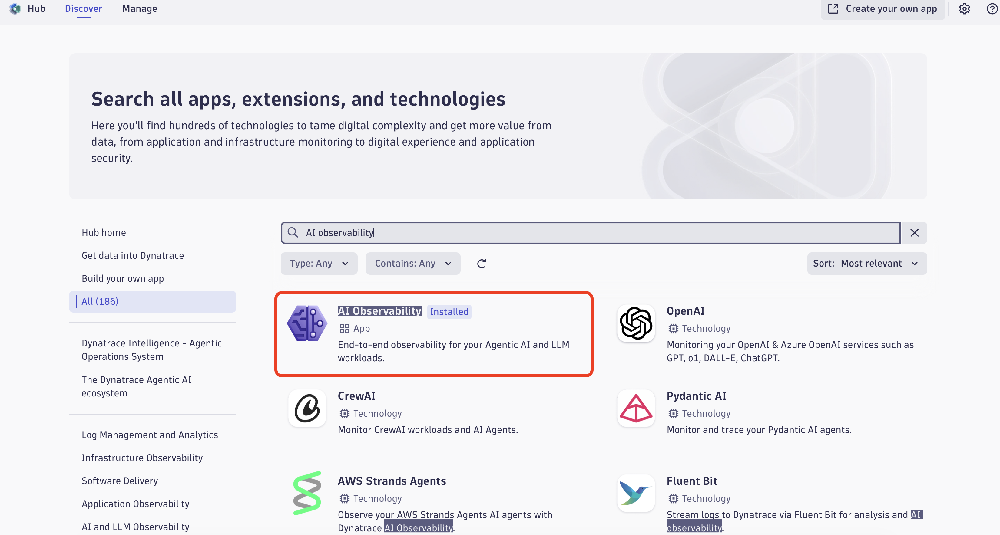</p>

2. Abra o app e clique em **Open** (ou **Install**, caso ainda não esteja instalado) para disponibilizá-lo na tenant.

   <p align="center">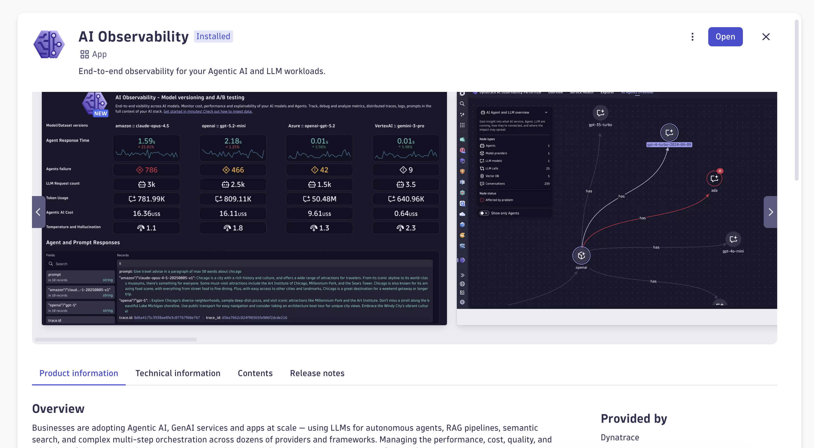</p>

</details>

<details>
<summary><strong>Gerar o token de acesso</strong></summary>

1. Abra o menu rápido com **Ctrl+K**, pesquise por `acc` e selecione **Access Tokens** (Classic apps).

   <p align="center">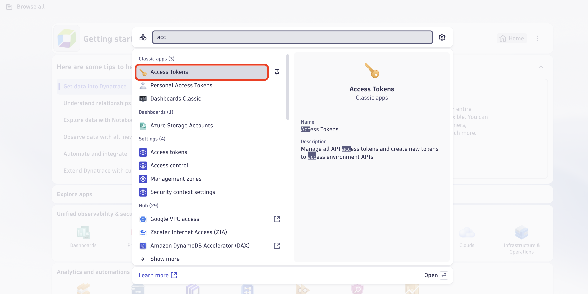</p>

2. Na tela de Access tokens, clique em **Generate new token**.

   <p align="center">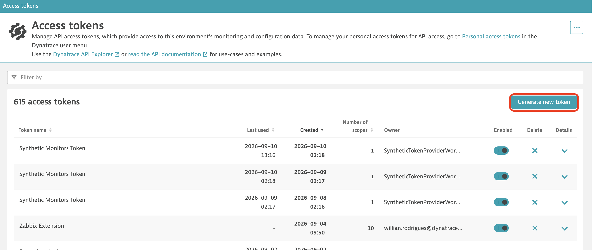</p>

3. Dê um nome ao token e selecione os scopes `metrics.ingest` (**Ingest metrics**) e `openTelemetryTrace.ingest` (**Ingest OpenTelemetry traces**). Em seguida, clique em **Generate token**.

   <p align="center">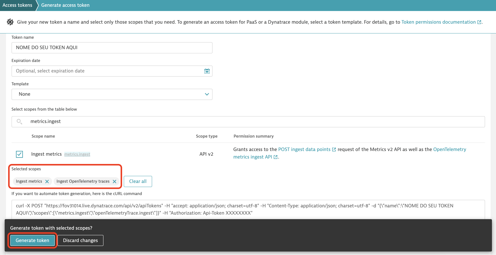</p>

</details>

### Developer machine

<details>
<summary><strong>Hardware</strong></summary>

| Resource | Minimum | Notes |
|---|---|---|
| RAM | 4 GB | Collector uses ~50–80 MB extra |
| CPU | Any | < 2% additional usage |
| Disk | 200 MB free | ~100 MB for cached collector binary |
| Network | Internet access | Required once on first activation (binary download) |

</details>

<details>
<summary><strong>Operating System</strong></summary>

| OS | Minimum version | Architectures |
|---|---|---|
| **macOS** | 10.15 Catalina | x64 (Intel), arm64 (Apple Silicon) |
| **Windows** | 10 build 17134 (1803) | x64 |
| **Linux** | Ubuntu 20.04 / Debian 11 / RHEL 8 / Fedora 36 | x64 |

> Windows 1803+ is required for the built-in `tar` command used to extract the collector binary.

</details>

<details>
<summary><strong>IDE</strong></summary>

| IDE | Minimum version |
|---|---|
| **VS Code** | 1.99.0 |
| **Cursor** | 0.40+ |

</details>

<details>
<summary><strong>Software (end-user)</strong></summary>

| Software | Version | Required for | Notes |
|---|---|---|---|
| **Python 3** | 3.6+ | Claude Code hooks | Pre-installed on macOS/Linux. Windows: install from [python.org](https://www.python.org/downloads/) and check **Add Python to PATH** |
| **tar** | Any | Extracting collector binary | Pre-installed on all supported OSes |

</details>

<details>
<summary><strong>Network and firewall requirements</strong></summary>

The extension requires outbound HTTPS (port 443) access to the following domains. **All connections are outbound only — no inbound ports are opened on the developer machine.**

> **For corporate environments:** share this table with your IT/security team before installation. Missing any of these will cause silent failures (no error shown to the user — data simply stops flowing).

**Required for installation (one-time):**

| Domain | Protocol/Port | What it does | When |
|---|---|---|---|
| `github.com` | HTTPS / 443 | Download the `.vsix` extension file from GitHub Releases | First install and updates |
| `objects.githubusercontent.com` | HTTPS / 443 | GitHub CDN — where release asset files are actually served from (GitHub redirects here) | First install and updates |
| `raw.githubusercontent.com` | HTTPS / 443 | GitHub raw file hosting — used during binary version check | First activation |

**Required for OTel Collector binary download (one-time, ~100 MB):**

| Domain | Protocol/Port | What it does | When |
|---|---|---|---|
| `github.com` | HTTPS / 443 | Fetch the release metadata for `otelcol-contrib` binary | First activation |
| `objects.githubusercontent.com` | HTTPS / 443 | Download the `otelcol-contrib` binary (tar.gz, ~100 MB) from GitHub Release assets | First activation only — cached permanently after |

The exact URL pattern for the binary download is:
```
https://github.com/open-telemetry/opentelemetry-collector-releases/releases/download/
  v{version}/otelcol-contrib_{version}_{os}_{arch}.tar.gz
```

**Required at runtime (continuous):**

| Domain | Protocol/Port | What it does | When |
|---|---|---|---|
| `*.live.dynatrace.com` | HTTPS / 443 | Send OTel traces and metrics to your Dynatrace tenant | Every time spans are generated |

Replace `*` with your tenant ID, e.g.: `abc12345.live.dynatrace.com`

**Local ports (no external access required):**

| Port | Used by | Notes |
|---|---|---|
| `4318` (TCP, localhost) | OTel Collector — OTLP HTTP receiver | Only accessible from localhost; receives spans from VS Code extensions |
| `4317` (TCP, localhost) | OTel Collector — OTLP gRPC receiver | Only accessible from localhost |
| `13133` (TCP, localhost) | OTel Collector — health check endpoint | Used by the extension to verify the collector started correctly |

> **Port conflicts:** ports are checked before the collector starts. If `4318` or `13133` is already in use, the extension automatically finds and uses the next free port and updates the setting for you. You can still set a preferred value manually:
> - `dynatraceAiObs.collectorPort` — controls the OTLP receiver port (default `4318`)
> - `dynatraceAiObs.healthCheckPort` — controls the health check port (default `13133`)

**Optional (Windows only — Python installation):**

| Domain | Protocol/Port | What it does |
|---|---|---|
| `python.org` | HTTPS / 443 | Download Python 3 installer (required for Claude Code hooks) |
| `files.pythonhosted.org` | HTTPS / 443 | Python package hosting (pip) |

**Summary for IT/security ticket:**

```
Allow outbound HTTPS (443) to:
- github.com
- objects.githubusercontent.com
- raw.githubusercontent.com
- *.live.dynatrace.com  (replace * with tenant ID)

Optional (Windows, Python install):
- python.org
- files.pythonhosted.org

No inbound rules required.
No VPN split-tunnel changes required.
```

</details>

---

## Installation (end users)

### Step 1 — Get the VSIX file

Download `dt-ai-observability.vsix` from the [Releases](../../releases/latest) page or request it from your team.

### Step 2 — Install in VS Code / Cursor

**Via UI (recommended):**
1. Open VS Code or Cursor
2. Click the **Extensions** icon (`Ctrl+Shift+X` / `Cmd+Shift+X`)
3. Click `···` (three dots) at the top of the Extensions panel
4. Select **Install from VSIX...**

   <p align="center">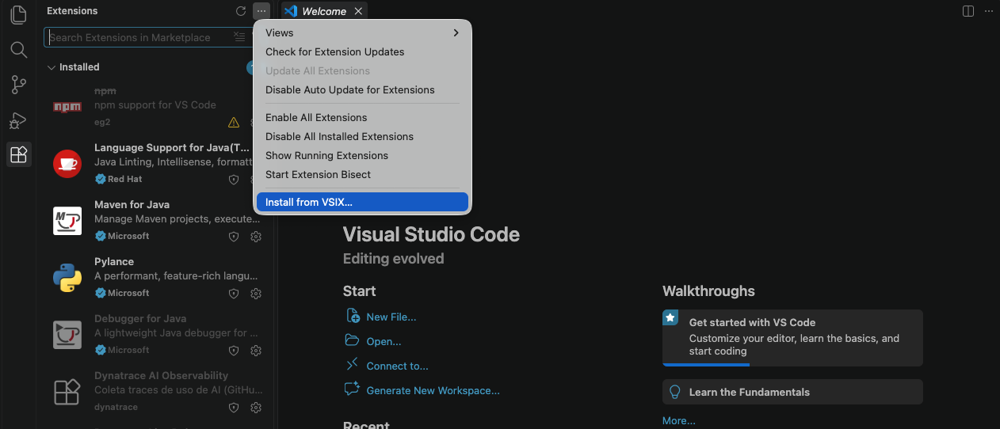</p>

5. Pick the downloaded `dt-ai-observability.vsix`

   <p align="center">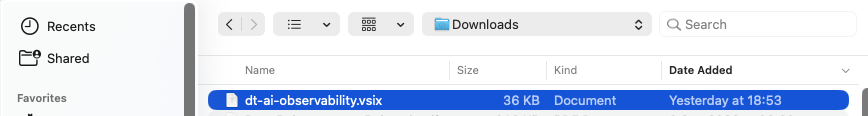</p>

6. Click **Reload**

**Via terminal (if `code` is in PATH):**
```bash
code --install-extension dt-ai-observability.vsix
```

### Step 3 — Configure credentials

On first launch, a prompt appears. Click **Configurar Agora** to open the unified management panel. You can reopen it at any time with `Cmd+Shift+P` → **Dynatrace AI Obs: Configurar Credenciais**.

<details open>
<summary><strong>Configuration tab</strong></summary>

The **Configurações** tab contains credentials, privacy controls, local ports, and custom attributes in one place.

> **Panel language:** a dropdown in the top-right corner of the panel lets you switch its UI between **Português (BR)**, **English**, and **Español** at any time — the choice is saved automatically and persists across restarts (`dynatraceAiObs.language`). This only affects the panel itself; Command Palette entries and VS Code notifications are unaffected.

| Field | Example | Notes |
|---|---|---|
| Tenant ID | `abc12345` | Recommended; the extension builds the OTLP URL automatically |
| OTLP Endpoint | `https://abc12345.live.dynatrace.com/api/v2/otlp` | Advanced mode; use `.live.`, not `.apps.` |
| API Token | `dt0c01.XXXXXXXXXX...` | Must start with `dt0c01.` |
| Email (optional) | `dev@company.com` | Appears in spans to identify the developer |

**Tenant ID mode (recommended)**

Enter only the tenant identifier. The generated OTLP endpoint is shown immediately below the field. The API token remains protected in the OS keychain, while the email identifies the developer in reports.

<p align="center">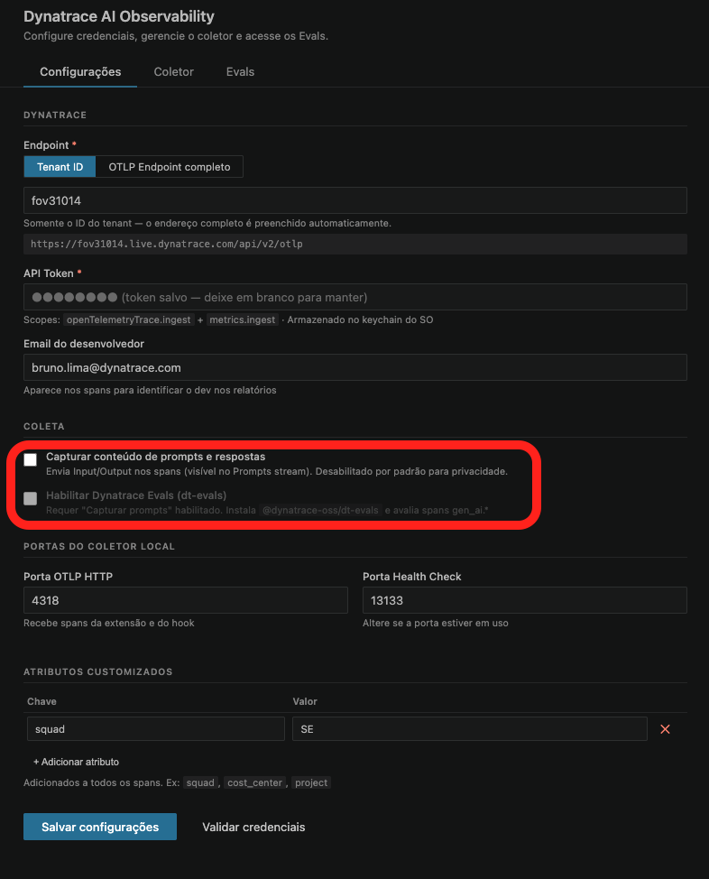</p>

The highlighted **Coleta** area controls data privacy. Enabling **Capturar conteúdo de prompts e respostas** unlocks Dynatrace Evals; when disabled, only metadata such as model, duration, tokens, and tool calls is collected.

**Full OTLP endpoint mode**

Choose **OTLP Endpoint completo** when using a custom or non-standard endpoint. Enter the complete `/api/v2/otlp` URL and verify that the hostname uses `.live.dynatrace.com`, never `.apps.dynatrace.com`.

<p align="center">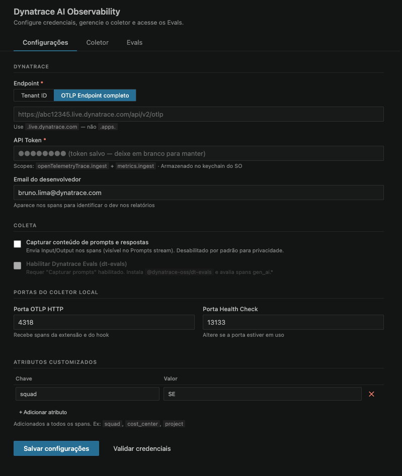</p>

Use **Validar credenciais** to test the endpoint and token, or just click **Salvar configurações** — credentials are now validated automatically before saving, and the collector restarts on its own to apply the new values.

</details>

<details>
<summary><strong>Collector tab</strong></summary>

The **Coletor** tab provides day-to-day operational control without leaving the panel:

- The status indicator shows whether the local OpenTelemetry Collector is running.
- **Iniciar**, **Parar**, and **Reiniciar** control the managed collector process.
- The live log keeps the latest 300 lines and follows new output while you are near the bottom.
- **Atualizar**, **Ir ao fim**, and **Limpar** help inspect startup, health checks, and export errors.

<p align="center">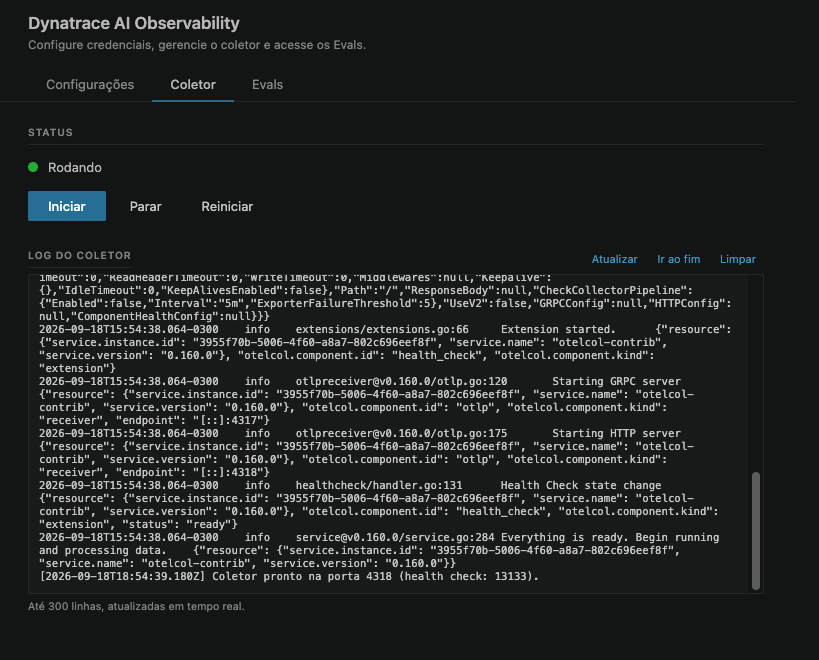</p>

</details>

<details>
<summary><strong>Evals tab</strong></summary>

The **Evals** tab centralizes the `@dynatrace-oss/dt-evals` workflow. Prompt capture must be enabled in **Configurações** before Evals can be activated; both toggles stay synchronized.

- **Instalar dt-evals** installs the CLI.
- **Abrir wizard de configuração** connects the tenant and configures the LLM judge.
- **Rodar Evals** selects evaluators, time range, sample size, and execution mode.
- **Validar setup** checks configuration and connectivity.

Interactive actions open in the integrated terminal so progress and prompts remain visible.

<p align="center">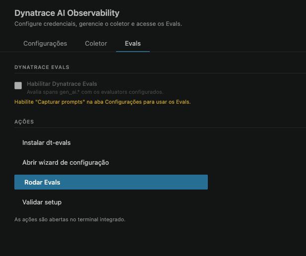</p>

</details>

The token is stored in the **OS keychain** via VS Code SecretStorage — never in plain text.

### Step 4 — First-time binary download

On first activation the extension automatically downloads the OTel Collector binary (~100 MB), caches it permanently, and starts it. A progress bar shows the download status.

### Step 5 — Verify it's working

**Status bar** (bottom-right corner):

| Icon | Meaning |
|---|---|
| `⊙ DT OTel` (orange) | Stopped or not configured |
| `↺ DT OTel` (spinning) | Starting / downloading binary |
| `● DT OTel` (normal) | Running and collecting |

**Check the collector process:**
```bash
curl http://localhost:13133
# Expected: {"status":"Server available","upSince":"..."}
```

**Check the Output panel:**

`View → Output → Dynatrace AI Observability`

You should see:
```
[...] [hooks] otel-hook.py atualizado em: ...
[...] Iniciando OTel Collector...
[...] Coletor pronto na porta 4318 (health check: 13133).
```

---

## Custom attributes

Add custom span attributes (squad, cost center, project, etc.) to every Claude Code and Copilot span without editing JSON files.

**Via Quick Pick UI (recommended):**

`Cmd+Shift+P` → **Dynatrace AI Obs: Gerenciar Atributos Customizados**

The command opens an interactive menu:
- **Add attribute** — type the key, then the value
- **Remove attribute** — select from a list of existing keys
- **Done** — saves and restarts the collector immediately

**Via the configuration panel:**

The **Configurações** tab also has an attributes table with a dedicated **Salvar / Atualizar atributos** button — edit the table and click it to persist the changes and restart the collector, without touching the rest of the settings.

Attributes are saved in `~/.claude/otel-attrs.json` (for Claude Code) and to VS Code settings (for the collector resource attributes).

**Example use cases:**

| Key | Value | Purpose |
|---|---|---|
| `squad` | `platform` | Filter by team in Dynatrace |
| `cost_center` | `cc-1234` | Chargeback reporting |
| `project` | `migration-v2` | Project-level attribution |
| `environment` | `staging` | Environment tagging |

---

## Understanding token counts

### Why Dynatrace shows far more tokens than expected

You may notice that a short question like *"What is the strongest Pokémon in the first region?"* (~10 tokens) appears in Dynatrace as **20,000+ tokens**. This is correct — and it reveals what AI tools actually cost.

When you send a message in GitHub Copilot Chat or Claude Code, the AI assistant does not receive just your question. It sends a complete API payload to the LLM that includes:

| Component | Tokens (approx.) |
|---|---|
| System prompt (assistant instructions, behavior rules) | 5,000 – 10,000 |
| Tool definitions (list of available tools + parameters) | 5,000 – 15,000 |
| Workspace context (open files, folder structure) | 0 – 5,000 |
| Conversation history (previous turns) | variable |
| Your actual question | 10 – 200 |
| **Total per request** | **15,000 – 30,000+** |

The Copilot Chat UI shows only your message's token count. The OpenAI tokenizer counts only what you paste into it. **Dynatrace shows the real number** — the full payload sent to the LLM API, which is what actually gets billed.

This is the core value of this observability extension: each question that looks like "10 tokens" in the Copilot UI is actually 20,000+ tokens at the API level. At scale, across hundreds of developers, this gap between perceived and real consumption is what drives unexpected AI costs.

---

## Validating data in Dynatrace

### AI & LLM Observability app

Open the **AI Observability** app in your tenant:

- **Overview tab**: shows total LLM requests, token usage, and model breakdown — Claude Code data appears here automatically.
- **Explorer tab**: click on `claude-code` service to see request-level details, latency, and token usage per conversation turn.
- **Distributed Traces**: full trace with span events containing prompt and completion text. Filter by `service.name = claude-code`.

> **Prompts stream tab**: shows both GitHub Copilot Chat and Claude Code data. Input/Output columns for Claude Code require `dynatraceAiObs.capturePrompts: true` in VS Code settings (disabled by default). System Prompt shows `-` for Claude Code — known limitation.

<details>
<summary><strong>DQL queries</strong></summary>

Open **Notebooks** in your tenant and run these queries.

#### Claude Code — prompt stream

```dql
fetch spans, from:now()-24h
| filter service.name == "claude-code"
| filter startsWith(span.name, "chat")
| filter isNotNull(`gen_ai.prompt`)
| fields
    timestamp,
    Developer     = `user.email`,
    Model         = `gen_ai.request.model`,
    Duration      = duration,
    Input_Tokens  = `gen_ai.usage.input_tokens`,
    Output_Tokens = `gen_ai.usage.output_tokens`,
    Prompt        = `gen_ai.prompt`,
    Response      = `gen_ai.completion`
| sort timestamp desc
```

#### Claude Code — usage by developer

```dql
fetch spans, from:now()-24h
| filter service.name == "claude-code"
| filter startsWith(span.name, "chat")
| summarize
    Requests      = count(),
    Input_Tokens  = sum(toLong(`gen_ai.usage.input_tokens`)),
    Output_Tokens = sum(toLong(`gen_ai.usage.output_tokens`)),
    Total_Tokens  = sum(toLong(`gen_ai.usage.input_tokens`) + toLong(`gen_ai.usage.output_tokens`)),
    Avg_Duration  = avg(duration)
  by: Developer = `user.email`
| sort Total_Tokens desc
```

#### Claude Code — usage by model

```dql
fetch spans, from:now()-24h
| filter service.name == "claude-code"
| filter startsWith(span.name, "chat")
| summarize
    Requests     = count(),
    Total_Tokens = sum(toLong(`gen_ai.usage.input_tokens`) + toLong(`gen_ai.usage.output_tokens`)),
    Avg_Duration = avg(duration)
  by: Model = `gen_ai.request.model`
| sort Total_Tokens desc
```

#### Claude Code — volume over time (7 days)

```dql
fetch spans, from:now()-7d
| filter service.name == "claude-code"
| filter startsWith(span.name, "chat")
| summarize
    Requests = count(),
    Tokens   = sum(toLong(`gen_ai.usage.input_tokens`) + toLong(`gen_ai.usage.output_tokens`))
  by: bin(timestamp, 1h)
| sort timestamp asc
```

#### Claude Code — cost estimate per developer

```dql
fetch spans, from:now()-30d
| filter service.name == "claude-code"
| filter startsWith(span.name, "chat")
| summarize
    Total_Cost_USD = sum(toDouble(`gen_ai.usage.cost_usd`)),
    Requests       = count()
  by: Developer = `user.email`
| sort Total_Cost_USD desc
```

#### Claude Code — tool calls

```dql
fetch spans, from:now()-1h
| filter service.name == "claude-code"
| filter startsWith(span.name, "claude.tool.")
| fields timestamp, span.name, claude.tool_input, claude.tool_response, claude.duration_ms
| sort timestamp desc
```

#### GitHub Copilot Chat spans

```dql
fetch spans, from:now()-1h
| filter service.name == "copilot-chat"
| filter isNotNull(`gen_ai.conversation.id`)
| fields timestamp, span.name, gen_ai.request.model,
         gen_ai.usage.input_tokens, gen_ai.usage.output_tokens
| sort timestamp desc
```

> The `isNotNull(gen_ai.conversation.id)` filter excludes Copilot's internal background calls (e.g. orchestration using `gpt-4o-mini`) that have no conversation context and are covered by the flat Copilot subscription — not billed per token to you.

</details>

---

## DQL Dashboard for Claude Code

Save as a **Notebook** in Dynatrace (Menu → Notebooks → New) to get a persistent dashboard equivalent to the AI Obs Prompts stream.

Paste the five queries above into separate tiles, set the time range to **Last 24 hours**, and pin to a Dashboard for team-wide visibility.

---

## Available commands

`Cmd+Shift+P` (or `Ctrl+Shift+P` on Windows/Linux):

| Command | Description |
|---|---|
| `Dynatrace AI Obs: Configurar Credenciais` | Set or update endpoint and API token |
| `Dynatrace AI Obs: Iniciar Coletor` | Start the collector manually |
| `Dynatrace AI Obs: Parar Coletor` | Stop the collector |
| `Dynatrace AI Obs: Ver Status` | Show whether the collector is running |
| `Dynatrace AI Obs: Gerenciar Atributos Customizados` | Add or remove custom span attributes via Quick Pick UI |
| `Dynatrace AI Obs: Configurar Hooks do Claude Code` | Set up Claude Code hooks manually |
| `Dynatrace AI Obs: Remover Hooks do Claude Code` | Remove Claude Code hooks |
| `Dynatrace AI Obs: Configurar Evals (dt-evals)` | Open the interactive Evals configuration wizard |
| `Dynatrace AI Obs: Rodar Evals` | Select evaluators and run an evaluation |
| `Dynatrace AI Obs: Validar Setup dos Evals` | Validate the Evals configuration and connectivity |
| `Dynatrace AI Obs: Ver Status dos Evals` | Show the resolved Evals configuration and status |

---

## Extension settings

| Key | Default | Description |
|---|---|---|
| `dynatraceAiObs.endpoint` | `""` | Dynatrace OTLP endpoint |
| `dynatraceAiObs.userEmail` | `""` | Developer email (appears in spans) |
| `dynatraceAiObs.autoStart` | `true` | Auto-start collector when VS Code opens |
| `dynatraceAiObs.capturePrompts` | `false` | Send prompt and response content in spans (Input/Output columns in Prompts stream). Disabled by default for privacy. |
| `dynatraceAiObs.collectorPort` | `4318` | Local OTLP HTTP port (receives traces from VS Code and Claude Code hook). Auto-adjusted if already in use. |
| `dynatraceAiObs.healthCheckPort` | `13133` | Collector health check port. Auto-adjusted if already in use. |
| `dynatraceAiObs.customAttributes` | `{}` | Custom attributes added to all spans (managed via Quick Pick command or the config panel) |
| `dynatraceAiObs.evalsEnabled` | `false` | Enable Dynatrace Evals; requires prompt capture |
| `dynatraceAiObs.language` | `"pt-BR"` | Configuration panel language: `pt-BR`, `en`, or `es`. Can also be changed from the dropdown inside the panel itself. |

---

## Cursor

### Claude Code inside Cursor

Claude Code runs as a CLI inside the Cursor integrated terminal. The hook-based integration works exactly the same as in VS Code — install the extension, and the hook is deployed automatically.

### Cursor native AI chat — current limitation

Cursor's built-in AI chat (the subscription-based model via `api2.cursor.sh`) does **not** expose OTel hooks or a configurable API endpoint for its native chat. This means it is not possible to capture native Cursor AI prompts with this extension today.

<details>
<summary><strong>What was investigated</strong></summary>

| Approach | Feasibility | Why not used |
|---|---|---|
| OTel env vars (`OTEL_EXPORTER_OTLP_ENDPOINT`) | ✗ | Cursor does not auto-instrument its AI calls |
| Custom OpenAI-compatible proxy | ⚠ Partial | Only works when user brings their own API key (not Cursor's subscription) |
| LiteLLM proxy | ⚠ Partial | Same limitation as above |
| HTTPS MITM proxy (mitmproxy) | ✗ | Requires system certificate install; Cursor may use certificate pinning |

**Workaround for users with their own API key:** configure Cursor to use a custom endpoint in **Cursor Settings → Models → Custom** pointing to a local OpenAI-compatible proxy that emits OTel spans. This is not included in this extension today.

This is a known gap — native Cursor AI observability requires Cursor to add OTel support to their platform.

</details>

---

## Troubleshooting

<details open>
<summary><strong>Common symptoms and fixes</strong></summary>

| Symptom | Likely cause | Fix |
|---|---|---|
| Orange status bar after setup | Binary still downloading | Wait — it's ~100 MB on first run |
| `curl localhost:13133` fails | Port 13133 already in use | The extension now finds a free port automatically; check the Output log for the port actually used |
| Extension fails to start on port 4318 | Port 4318 already in use | Same as above — an alternative port is chosen and saved automatically |
| No spans in Dynatrace | Invalid token or endpoint uses `.apps.` | Reconfigure via **Configurar Credenciais** — credentials are now validated before saving |
| `user.email` null in spans | Email not filled during setup | Reconfigure and add email |
| Download fails | No access to `github.com` | Check proxy/firewall; allow `github.com` and `objects.githubusercontent.com` |
| Copilot sends data but Claude Code doesn't | Python 3 not found | Run `python3 --version` in terminal; install if missing |
| Claude Code model shows as "claude" (not full name) | Old spans before fix | Only affects historical spans; new spans show `claude-sonnet-4-6` etc. |
| Custom attributes command not found | Extension not updated | Reinstall from latest VSIX |
| Claude Code hooks not executing | Claude Code not restarted after hook setup | Close and reopen Claude Code |
| System Prompt shows `-` in Prompts stream | Claude Code does not expose its system prompt to hooks | Known limitation — no fix available |

</details>

---

## Building from source

```bash
# 1. Clone
git clone https://github.com/pmoreira-dynatrace/dt-ai-observability-vscode
cd dt-ai-observability-vscode

# 2. Install dependencies
npm install

# 3. Compile
npm run compile

# 4. Build VSIX
./scripts/package.sh
# Output: dt-ai-observability.vsix
```

The binary (~100 MB) is downloaded automatically on first activation — it is never bundled in the VSIX.

<details>
<summary><strong>Project structure</strong></summary>

```
vscode-dt-ai-observability/
├── src/
│   ├── extension.ts      — entry point, activation and configure flow
│   ├── collector.ts      — OTel Collector process lifecycle, port auto-discovery
│   ├── downloader.ts     — platform detection, binary download and cache
│   ├── claudeHooks.ts    — Claude Code hook script (Python) + auto-install
│   ├── configPanel.ts    — three-tab configuration and operations webview
│   ├── evals.ts          — dt-evals installation and terminal workflows
│   └── statusBar.ts      — VS Code status bar indicator
├── resources/
│   └── otel-collector.yaml  — Collector config (uses env vars for credentials)
├── scripts/
│   └── package.sh        — builds the VSIX
├── README.md
└── package.json
```

</details>

---

## Privacy and security

- **Prompt and response capture**: disabled by default (`dynatraceAiObs.capturePrompts: false`). Enable in VS Code settings to populate the Input/Output columns in the Prompts stream. When disabled, only metadata is captured (model, duration, token counts, tool calls). To stop all capture, use **Dynatrace AI Obs: Remover Hooks do Claude Code**.
- **Token stored in OS keychain**: VS Code SecretStorage is backed by the OS keychain (Keychain on macOS, Credential Manager on Windows, libsecret on Linux) — never stored in plain text or `settings.json`.
- **Credentials validated before saving**: the configuration panel checks the endpoint and token against the Dynatrace API before writing them, so a bad token or URL is caught immediately instead of failing silently at runtime.
- **Collector makes outbound HTTPS only**: The local collector only connects outbound to your Dynatrace tenant. No public port is exposed.
- **Verifiable binary**: Downloaded directly from [open-telemetry/opentelemetry-collector-releases](https://github.com/open-telemetry/opentelemetry-collector-releases).

---

## License

MIT — see [LICENSE](LICENSE)
